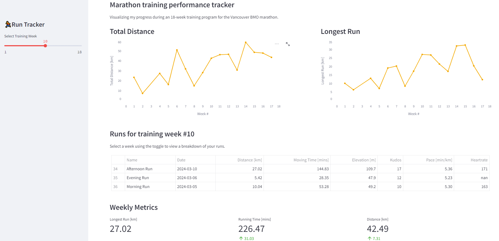

## Running Progress Visualization Tool
Welcome! I built this dashboard to analyze my progress on my 18-week training plan for the Vancouver BMO Marathon. I'm hoping fellow running enthusiasts can use it to visualize their own data. If you're interested, please check out [this](https://medium.com/@juliaeveritt13/taking-my-strava-obsession-to-the-next-level-78cba3bb787a) blog post for help accessing your activity data using the Strava API.


### Motivation
The target user is somebody training for a race. The Strava app provides a default dashboard displaying total distance week-by-week, but some users may want more flexibility and a more detailed analysis of their running progress. For example, you may want to change which day your weeks 'start' on, or see how your mileage and weekly long runs are stacking up against your training plan. This dashboard allows users to intuitively look through their running analytics on a weekly basis and can easily be adapted to display new statistics of interest. There is tons of detailed activity information available for free using the Strava API - let's take advantage of that!

### The Data
This dashboard uses my personal strava data. If you are interested, I encourage you to check out my blog post and use the provided preprocessing script to visualize your own data. 

### How to use
1. Clone the repository
2. Create the virtual environment
```
conda env create -f environment.yml
conda activate strava-dashboard
```
3. Run the dashboard
```
streamlit run src/app.py
```

### ©️ License
This dashboard is licensed under the terms of the MIT license.